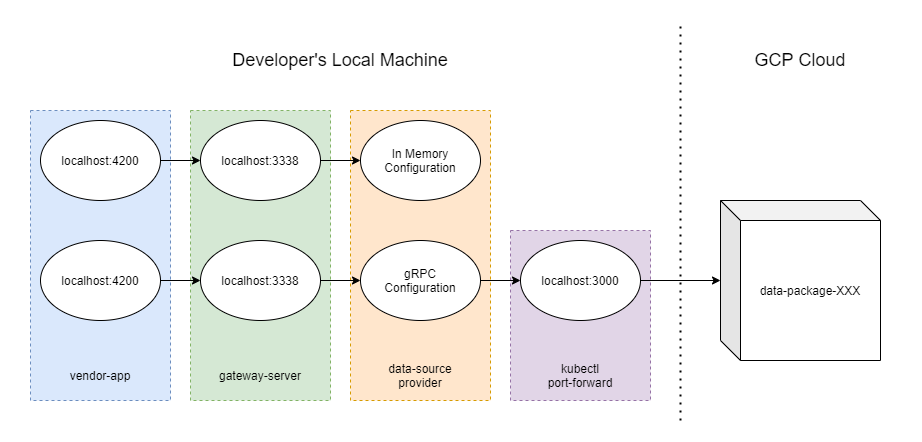
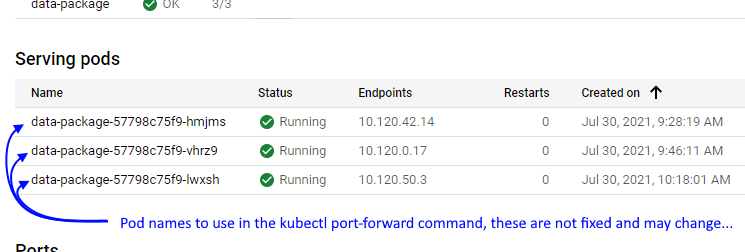

# server-data-packages-vendor

Be sure to have your consuming server project's NestJS module import this package's module and pass in any arguments.

```
ServerDataPackagesVendorModule.forRoot({
  dataSourceType: {
    type: 'in-memory',
    count: 100
  }
})
```

## Running with a gRPC data source

You can configure your consumer to use the gRPC data source with options like below.

```
ServerDataPackagesVendorModule.forRoot({
  dataSourceType: {
    type: 'grpc',
    grpcHost: 'localhost',
    grpcPort: '3000',
    protoPath: join(__dirname, 'assets', 'proto', 'data-package-resource.proto')
  }
})
```

Do also be sure to include in your consuming server's project configuration the assets object to copy the required `proto` files.

```
{
  ...
  "projects": {
    ...
    "your-server": {
      ...
      "targets": {
        "build": {
          ...
          "options": {
            ...
            "assets": [
              {
                "glob": "**/*",
                "input": "libs/server/data-packages/vendor/src/assets/proto",
                "output": "assets/proto"
              }
            ]
          }
        }
      }
    }
  }
}
```

## Running (locally) with a gRPC data source

### Running with a remote gRPC data source (GCP cloud)

We'll use the first consuming application as an example: `gateway-server` 



You must provide configuration that allows for an actual gRPC connection. Refer to the configuration in the `Running with a gRPC data source` section above.

If you want to connect to a P4D source while developing locally, you can run the following in your terminal to establish a proxy to a deployed pod. This requires `gcloud` to be installed locally and to be initially configured with access to the GCP project that has your data-package pod. Please find support for `gcloud` setup and Google Project access verification on [the GAIA OSDU Dev channel](https://teams.microsoft.com/l/channel/19%3a04d495ed644941949e37523beb6f7f14%40thread.skype/Dev?groupId=a48f135a-8890-43b9-9cbc-67e3a6ba2864&tenantId=41ff26dc-250f-4b13-8981-739be8610c21) via MS Teams. Your local consumer project can establish a gRPC connection through this proxy. 

```
gcloud container clusters get-credentials dmp-cluster-light-evd \
	--region us-east1 \
	--project marketplace-evd \
&& kubectl port-forward data-package-<POD NUMBER HERE> 3000:8001 --namespace gaia-light-evd
```

You can find a pod name to use above by going to [the GCP K8s data-package service details page](https://console.cloud.google.com/kubernetes/service/us-east1/dmp-cluster-light-evd/gaia-light-evd/data-package/overview?project=marketplace-evd) and by looking for the below:



### Running with a local gRPC data source

First start the gRPC service on local, configure your gRPC service to run on localhost and the port you want. Then go to the environment.ts under gateway-server/src/environments, change 'dataSourceTypes' field to:

```
dataSourceTypes: {
    type: 'grpc',
    grpcHost: 'localhost',
    grpcPort: 'YOUR_GRPC_SERVICE_PORT',
    protoPath: join(__dirname, 'assets', 'proto', 'PROTO_FILE_NAME_OF_YOUR_GRPC_SERVICE')
}
```

Then you can start the server and run with your local gRPC service.

## Running unit tests

Run `nx test server-data-packages-vendor` to execute the unit tests via [Jest](https://jestjs.io).
